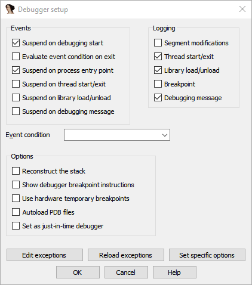
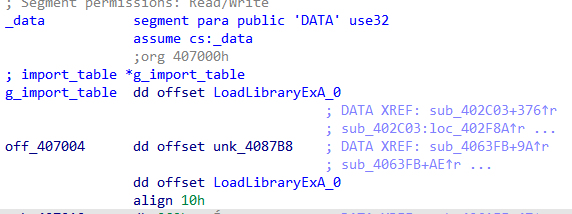
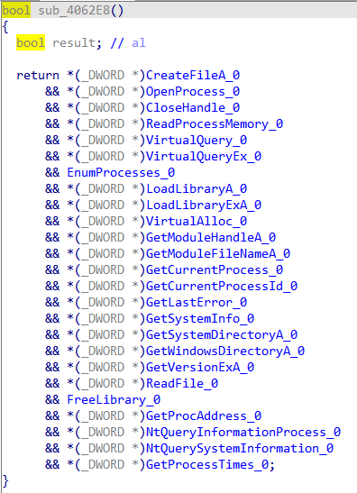
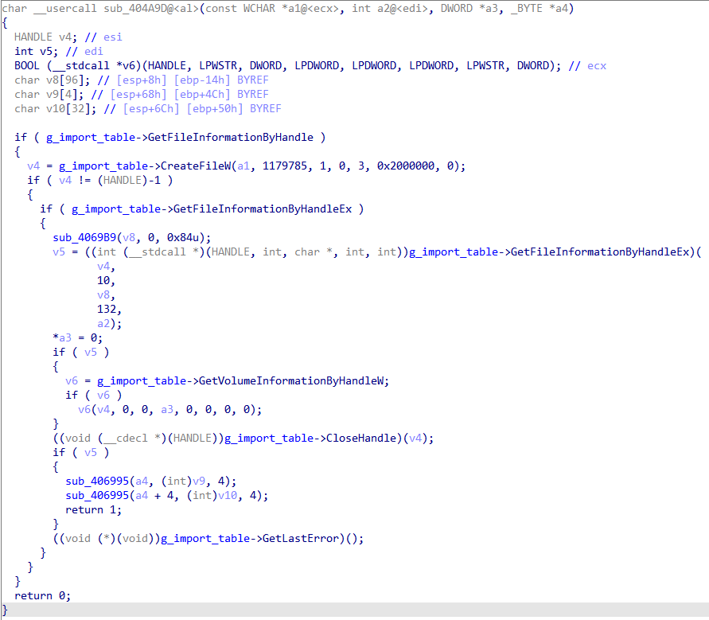

# vacation3
An emulator powered by [Qiling]() to deobfuscate/decrypt VAC3 modules.

## Information
This repository is currently a proof of concept and may require manual changing of offsets for different types of modules. The current offsets were successfully tested using the modules that are loaded upon initialization.  
To update the emulator refer to `emu.py`. Dumping the DLLs and packets is left as an exercise to the reader but will eventually be entirely automated as well.

## Usage
Make sure `emu.py` is laying in a folder that contains all necessary 32 bit DLLs and the respective Qiling folder structure.  
To be able to decrypt the modules you have to set the global in `emu.py` to the received packet. Example:  

```py
packet = bytes([int(x, 16) for x in """
95 5c 15 0f 01 00 00 00 19 9c eb dd 17 ed 65 02 10 2f a8 ba c9 35 95 a7 49 f4 42 24 7d d5 00 11 ca 5b b4 62 56 92 ec f5 66 fd 10 31 ab 7b c5 31 e8 7e 26 54 d9 59 fc 42 21 4a 09 cd 41 0d bd 53 15 f9 8f 74 c5 8f eb 53 dd 96 66 10 2d 4d fa 75 b5 46 7d 91 13 b4 e5 98 84 ec 8f 01 bb 72 14 7c 10 91 25 32 77 54 f1 7e 0a c7 99 21 20 1b 5b f1 c1 c0 a4 48 bf 0e 1f 08 47 51 6b a6 6e e7 1e 89 bc f6 c6 40 37 a9 61 07 5e 0a f8 7c 43 80 ee 56 fa 60 c1 69 1e dc dd 17 f9 56 0c cf 3a cc 04 2d ca ac 57 7c b6 3c 1e dd 31 0d c0 58 3a 0b 4a aa
""".strip().split(" ")])
```

Running the emulator will create snapshots as an initial run may take a few minutes to complete. The files `ida.py` and `import_table.h` are created as soon as the emulator terminates.  

* `ida.py`: Renames global function pointers to their respective Win32 API call. Load this as a script into IDA.
* `import_table.h`: Contains a structure that defines the created import table at runtime. Load this as additional header file into IDA.  

However, to be able to use those files you have to follow a few more steps:  
The emulator will spin up a gdb debug session that you can connect to using IDA. Make sure to load up your dump in IDA, connect to the debugger (using gdb remote debugger) and make a memory snapshot. This will populate your IDA DB with the decrypted memory. Make sure your IDA debugger settings satisfy Qiling's needs:  



To be able to assign the structure you can simply find the pointer in the DB and assign `import_table*` to it:  



The result will look like the following:  

  
  


## Notes
`typedefs.h` is generated from another script. The repository will be linked here as soon as I published it. This file contains a big portion of Win32 API calls with their respective call prototype.